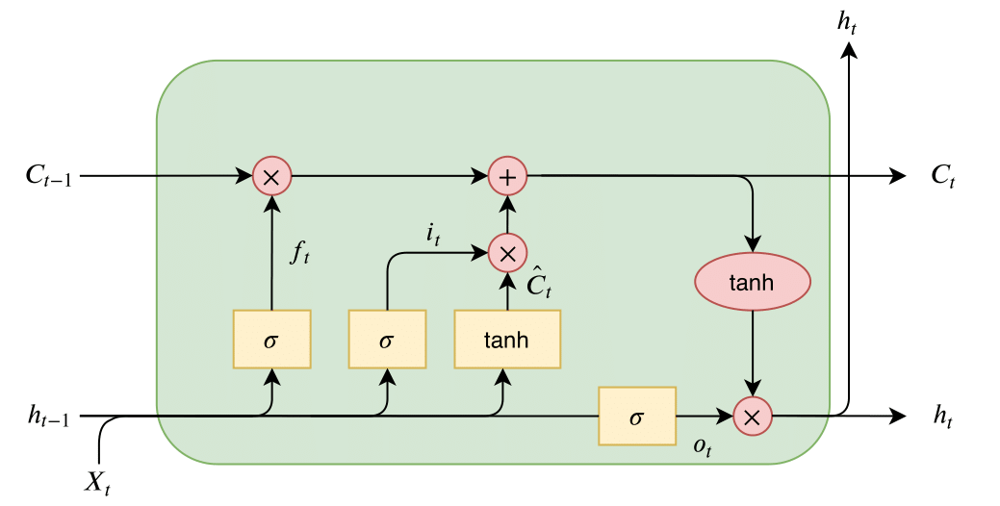
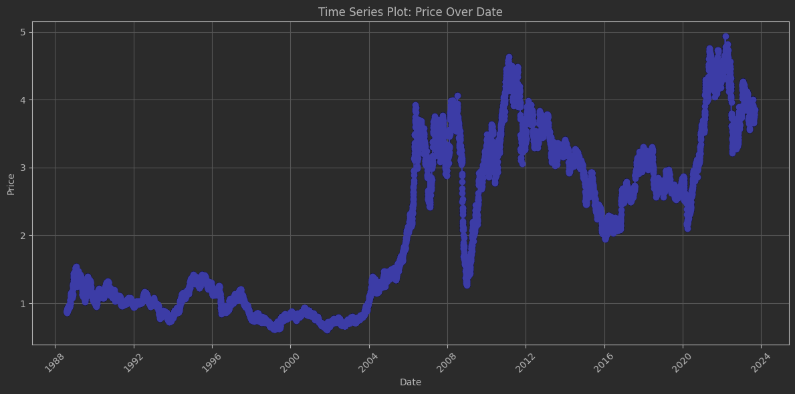
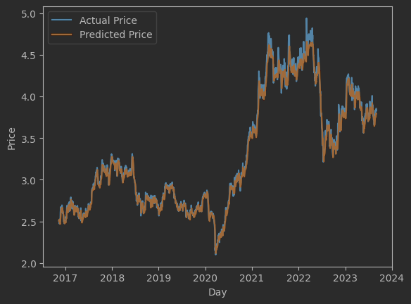
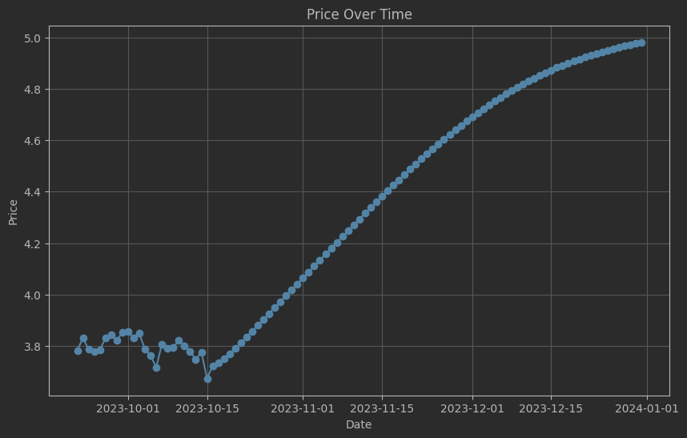
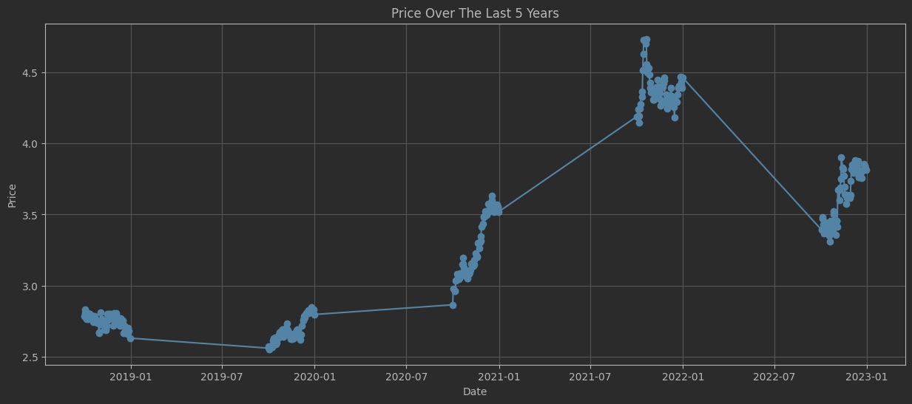

# **Copper Price Predictions**
## Introduction
This Software aims to forecast the price of Copper, given its price history. This Software uses
a Long Short Term Memory to make the predictions. 

## Methodology
### Long Short Term Memory (LSTM)
It is a type of recurrent neural network (RNN) that is capable of learning long-term dependencies. This makes it 
well-suited for tasks such as speech recognition, machine translation, and text generation. RNNs are a type of neural network that can process sequential data. This means that they can 
learn to predict the next item in a sequence, given the previous items. LSTM solves RNN main issue 
which is the vanishing gradient problem. The vanishing gradient problem is when the gradient of the loss function is 
calculated with respect to the weights of the neural network. This gradient is then used to update the weights. The
problem is that the gradient can get very small as it is propagated backward through the network. This means that the
weights in the network will not be updated effectively. This makes it difficult for the network to learn long-term
dependencies in the data. LSTM solves this problem by using a gating mechanism. This mechanism can learn which data in
a sequence is important to keep or throw away. By doing this, it can pass relevant information down the long chain of
cells to make predictions. This LSTM is using a *tanh* function.

### 1. Data Cleaning and Preprocessing (clean.ipynb)
- The Dataset is downloaded as CSVs from [here](https://www.investing.com/commodities/copper-historical-data) into 
*dirty_dataset_1.csv* and *dirty_dataset_2.csv*.
- Data is then cleaned by removing unnecessary columns, just keeping the **Date** and the **Average Price for the Day**.
- Outliers(Prices lower than 0.1 USD) are replaced by the mean Price of the 7 previous days.
- The cleaned data are exported as a csv in *cleaned_dataset.csv*
- Prices are then plotted against the corresponding dates.

### 2. Training, Optimising and Testing the model (train_and_test.ipynb)
- The cleaned, preprocessed data is loaded from *cleaned_dataset.csv*.
- Data is now scaled between (-1,1) using MinMaxScaler to make the learning process more efficient. When the features 
have different scales, the gradient updates can be very large for some features and very small for others. This can make 
the learning process slow and unstable. Scaling the features to the same range helps to equalize the gradient updates 
and make the learning process more efficient. Another reason is to prevent the model from overfitting. When the features 
have different scales, the model can become too sensitive to the features with the larger scales. This can lead to 
overfitting, where the model learns the noise in the data instead of the underlying patterns. Scaling the features to 
the same range helps to reduce the model's sensitivity to noise and prevent overfitting.
- Data is splitted into training set and test set to evaluate the model(80:20 split).
- Both Sets are prepared as a Dataset objects to allow the model to use them, where each day stores the prices of the
previous 7 days, as well as the price for the day itself.
- The neural network which takes 1 input, consists of 4 hidden units and 1 stacked layer is then trained and the 
parameters are tuned by Adam. Adam is an adaptive learning rate optimization algorithm that is used to train deep 
learning models. It is a combination of the AdaGrad and RMSProp algorithms, and it is designed to be more efficient 
and effective than these algorithms.
- Batch size is set to 16 to avoid overfitting.
- The model was tested and achieved a root mean squared error of 0.06.
- The predicted prices for the test data and the actual prices are plotted on the same graph for comparison.

### 3. Forecasting (train_and_predict.ipynb)
- Data is loaded from *cleaned_dataset.csv* and the model is prepared.
- A DataFrame is used to store the predicted price of a week to be provided for the model when predicting each day.
- The model is retrained over the whole set of data again from 01-08-1988 to 21-09-2023.
- Prices are then plotted against the corresponding dates.

- Q4 Prices are now evaluated for comparison with the last 5 years of the actual prices.

## Conclusion
This model is perfect for prediciting the prices of Copper and other metals, however this model is data-hungry and requires large 
dataset to train. 
